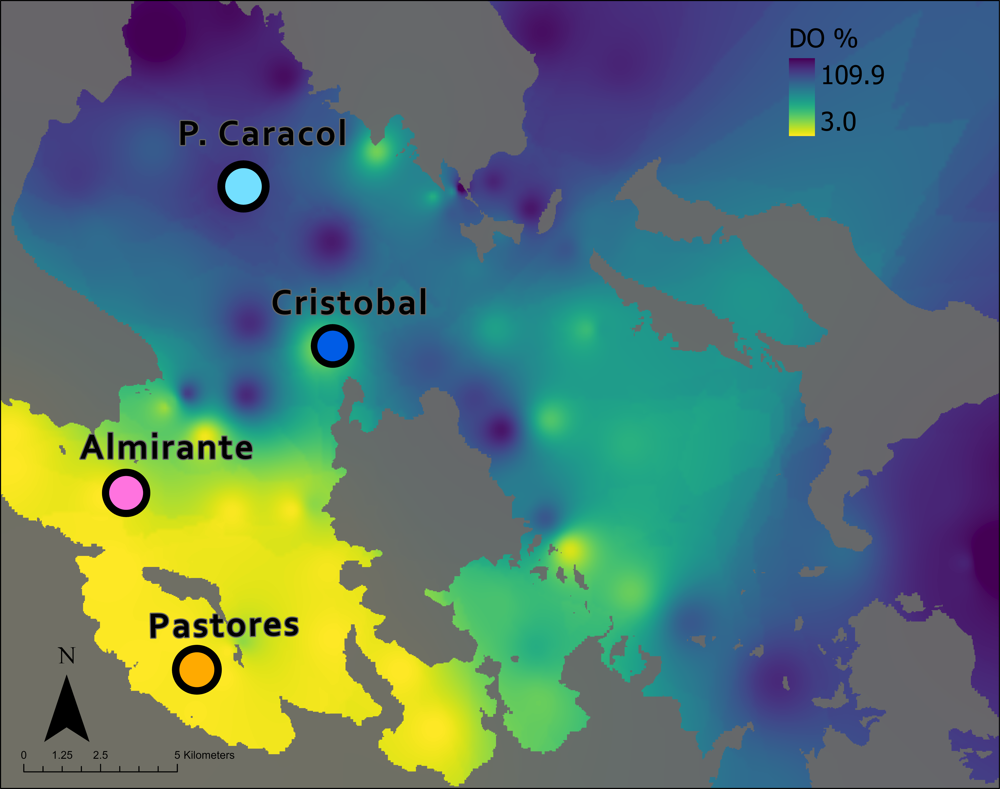
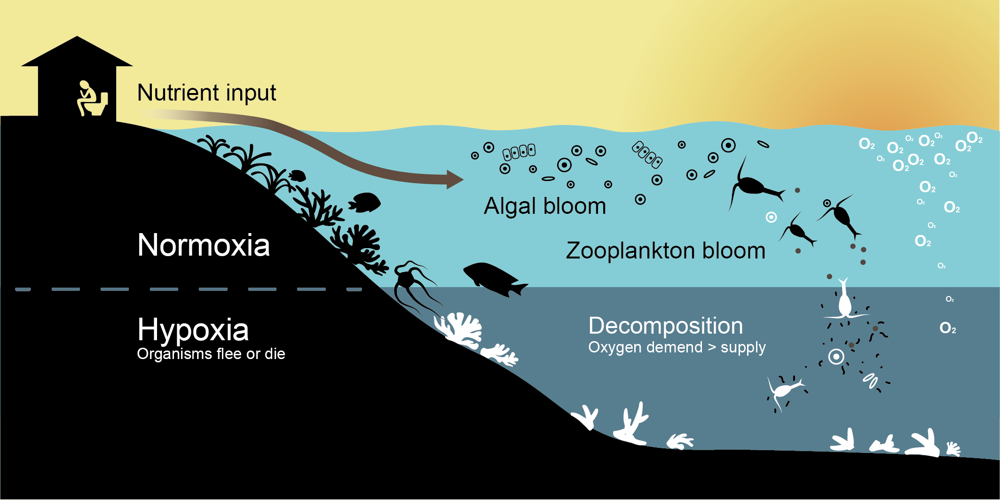

```{r setup, include=FALSE}
knitr::opts_chunk$set(echo = TRUE, eval = TRUE) # echo=true, visible code, eval=true, with output

remove(list = ls())
```

**Are microbes responsible for decreasing marine biodiversity? A case
study of coastal deoxygenation in tropical marine sediments**

**Issue**: Ocean Deoxygenation is an Emerging Threat for Coastal
Ecosystems,

**Problem**: Hypoxia in marine habitats is becoming more common but the
process of recovery after either episodic or seasonal hypoxia is largely
unknown. Microbial community structure is linked to macrofaunal
community structure, and both are influenced by changing environmental
condition. However, we don't really understand how.

**So What?**:

# Abstract

Climate change is disproportionately impacting coastal marine ecosystems
through complex interactive multiple stressors. Microbes are without a
doubt important in these coastal systems, yet the microbial ecology of
many marine systems is still poorly understood. Our research aims to
address pressing questions regarding which microbial assemblages are
correlated to broad-scale ecosystem shifts in coastal habitats. We
measured environmental oxygen, temperature, and pH weekly over the
course of a year at four shallow sites (\~20 m) along a natural \~15 km
gradient in a Caribbean Bay. In addition to environmental parameters, we
collected weekly sediment samples and determined the abundance and
diversity of both the macrofauna and microbial communities (16S rRNA)
throughout the year. At sites with severe deoxygenation (compared to
more normoxic sites), we find a strong relationship between reduced
macrofaunal abundance and diversity, as well as significant differences
in microbial community composition. Using an integrative time-series
approach we identify specific oxygen thresholds that appear to underpin
changes in both macro- and micro- benthic diversity. These results hint
at potential microbial drivers involved in benthic community changes,
however a more complete understanding of the functional role of
microorganisms in these systems requires a metagenomic approach.

# Methods

We collected sediment from each site (\~20 meters) with a 6" x 6" petite
Grab sampler weekly. The sampler was attached lowered to the seafloor
from a boat and collected 2 L of sediment from the surface of the
seafloor. The material was immediately put into sterile bags after
collection and stored on ice in the boat. Upon arrival at the lab, three
technical replicate samples (1 mL) will be taken from each sample site
for microbial analyses. Fresh sea water running through a 1 μm polyester
felt filter bag was used to sieve the remaining sample material into
three size classes. The sediment and detritus retained by the screens
(125, 250 μm and 500 μm) was immediately stored in 4 % buffered formalin
for 48 hours and then transferred to 70 % EtOH and stained with 2g/L
Bengal Rose for long-term preservation. This prevents any calcium
carbonate corrosion due to formalin and turns all specimens that were
alive at the time of sampling a bright red color. Sample material was
sorted and all living organisms (stained red) were removed under a
dissecting microscope from the sediment. These organisms were then
counted and identified to the lowest level possible.

## Sites

-   Almirante: seasonal low oxygen for past 8 years\
-   Pastores: seasonal low oxygen for past 8 years\
-   Cristobal: normoxic for past 8 years\
-   Punta Caracol: normoxic for past 8 years

```{r, echo=FALSE, fig.cap="Four study sites within Almirante Bay. Color gradient shows the oxygen saturation (%) approx. 1 meter above the seafloor. Oxygen was measured at 83 sites throughout the bay on Sept. 24, 2017 and values interpolated with ArcGIS.", out.width = '100%'}

```

# Discussion

## Coastal Hypoxia

```{r, echo=FALSE, fig.cap="Process of Coastal Hypoxia in Almirante Bay", out.width = '100%'}

```

## Benthos

```{r, echo=FALSE, fig.cap="Bacterial Mats covering the benthos in Almirante Bay", out.width = '100%'}
knitr::include_graphics("trepo_pics/mats-min.png")
```

```{r, echo=FALSE, fig.cap="Coral reef near Almirante Bay", out.width = '100%'}
knitr::include_graphics("trepo_pics/seafloor-min.png")
```

## Source Code {.appendix}

The source code for this page can be accessed on GitHub by [clicking
this
link](https://github.com/tropical-repo/web/blob/master/trepo-physical.Rmd).
