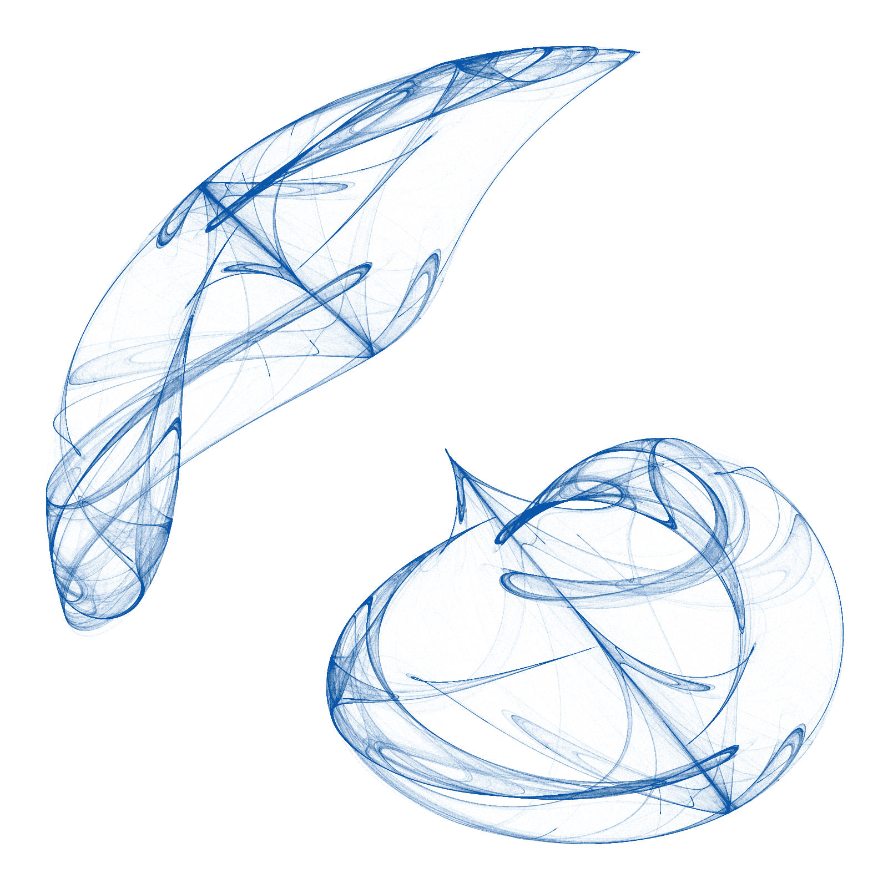

```{r setup, include=FALSE}
knitr::opts_chunk$set(collapse = TRUE)
library(DT)
library(Rcpp)
library(ggplot2)
library(dplyr)
```

COMING SOON :-)

<br/>

```{r, echo=FALSE}

```


```{r, clifford, echo=FALSE, eval=FALSE}
opt <- theme(legend.position  = "none",
            panel.background = element_rect(fill="white"),
            axis.ticks       = element_blank(),
            panel.grid       = element_blank(),
            axis.title       = element_blank(),
            axis.text        = element_blank())

cppFunction('DataFrame createTrajectory(int n, double x0, double y0,
            double a, double b, double c, double d) {
            // create the columns
            NumericVector x(n);
            NumericVector y(n);
            x[0]=x0;
            y[0]=y0;
            for(int i = 1; i < n; ++i) {
            x[i + 1] = sin(a*y[i]) - cos(b*x[i]);
            y[i + 1] = sin(c*x[i]) - cos(d*y[i]);
            }
            // return a new data frame
            return DataFrame::create(_["x"]= x, _["y"]= y);
            }
            ')

# Parameters:
#a = -1.164
#b = 1.41
#c = -1.42
#d = -1.6

a = 1.7
b = 1.7
c = 0.6
d = 1.2
df <- createTrajectory(10000000, 0, 0, a, b, c, d)
```


```{r, echo=FALSE, eval=FALSE}
ggplot(df, aes(x, y)) +
  geom_point(color = "#B1624E", shape = 46, alpha = .01) +
  opt +
  theme(panel.background = element_rect(fill = '#FAFAFA'))
```

```{r, echo=FALSE, eval=FALSE}
#png("clifford_fac015.png", units = "px", width = 1600, height=1600, res=100)

ggsave("images/clifford_fac015.png", width = 40, height = 40, units = "cm", dpi = 100)

#dev.off()
```