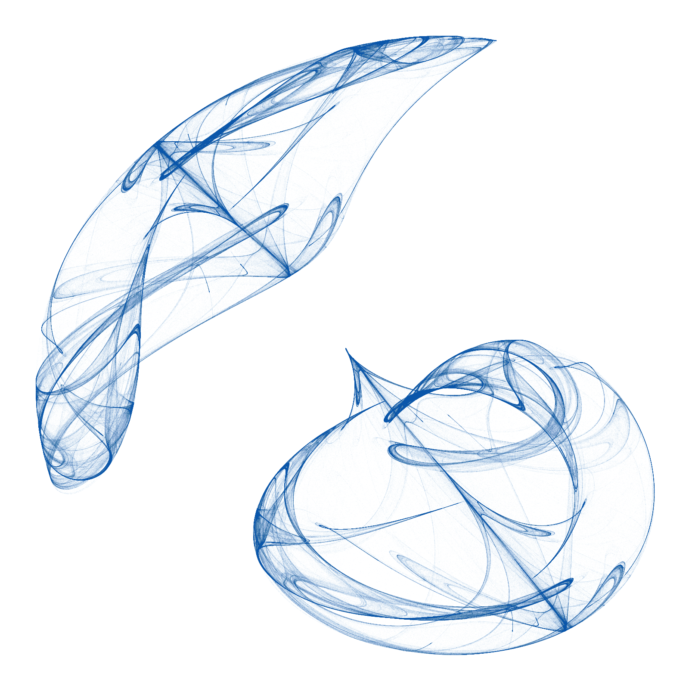

```{r setup, include=FALSE}
knitr::opts_chunk$set(echo = TRUE, eval = FALSE)

# Add libraries here

options(scipen=999)
knitr::opts_current$get(c(
  "cache",
  "cache.path",
  "cache.rebuild",
  "dependson",
  "autodep"
))
```

> Hit the *Hide Code* button to hide the R code.

<aside>

```{r codefolder_ssu, echo=FALSE, results='asis', eval=TRUE}
codefolder::generic(init = "show", query = "pre.sourceCode",
  style = "position: absolute; right: 14%; z-index: 200")
```

</aside>

you should be able to render this page in all of its glory by typing this in the console (assuming you first opened `web.Rproj`):

```{r}
rmarkdown::render_site("test.Rmd")
```

<br/>

```{r, echo=FALSE}

```


