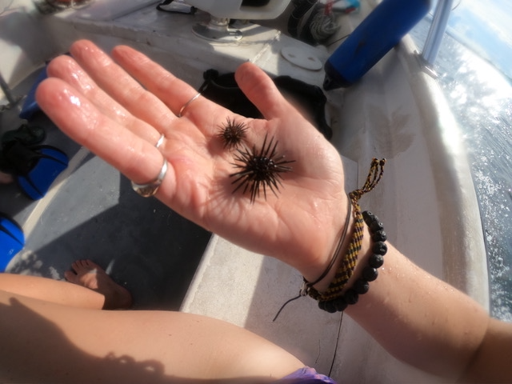
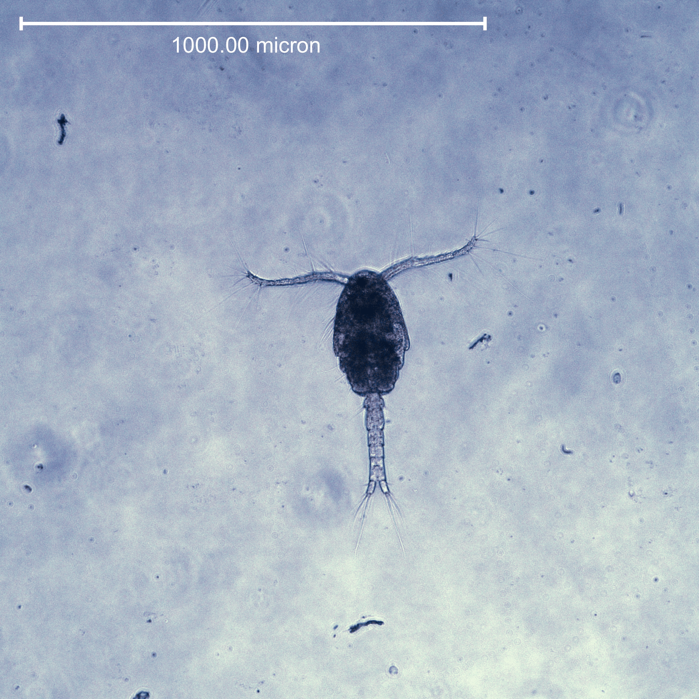
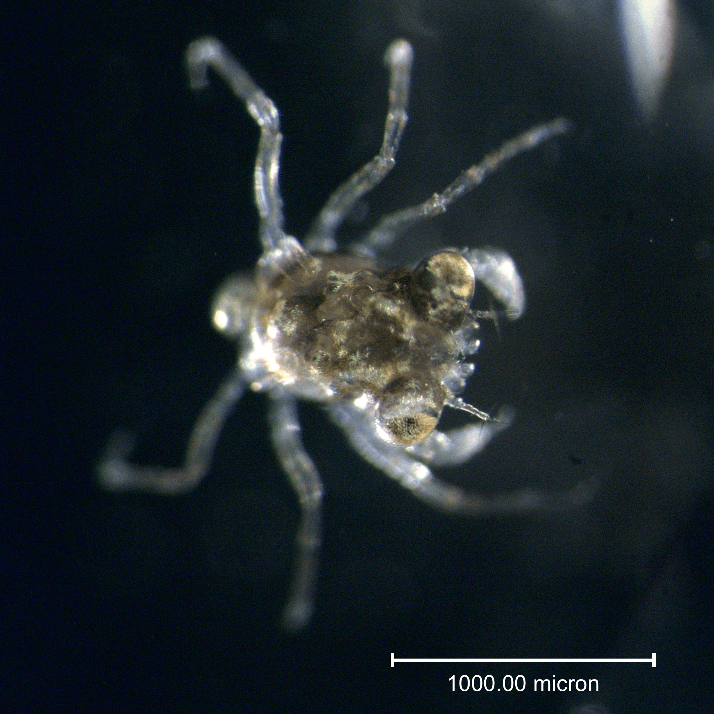

```{r setup, include=FALSE}
knitr::opts_chunk$set(echo = FALSE, eval = TRUE) # echo=true, visible code, eval=true, with output
```

# Creatures of Interest

From the previous workflows, we have determined that species abundance changes with the season and site. For example, of the 17 taxa indentified in our samples, Errantia is the only one affected by a significant site x season interaction. Others, such as Caudofoveata and Ostrocoda where affected by site differences, whereas Bivalves were affected by seasonality.  

Significant Site Effects

-   Sedentaria 

-   Errantia 

-   Caudofoveata 

-   Ostracoda

Significant Season Effects:

-   unidentified taxa

-   Caudofoveata

-   Bivalvia 


Significant Site X Season Interaction:

-   Errantia 

Here we explore the biology and ecology of these taxa in more detail. 
Where do these creatures live? What do they eat and how do they eat it?
What eats them? How do they protect themselves? How do they breath?

## 1. Polychaetes

### a.  *Errantiata*

Also known as *Aciculata* these are worms that move with their chaetae.

Errantiata are a subclass of polychaetes (segmented marine worms). They
are free-living and can be found throughout the world in marine and
brackish environments. They usually have well developed jaws and sensory
organs.

```{r fig.cap="Fireworm found on reef matrix near Almirante"}
knitr::include_graphics("trepo_pics/worm2.png")
```


### b.  *Sedentaria* 

Worms that don't move Sedentaria are non-mobile polychaetes (subclass). They often have specialized gills or tentacles used for respiration and deposit or filter feeding.
    
```{r fig.cap = "Figure from: https://upload.wikimedia.org/wikipedia/commons/9/93/Spirobrancheus_giganteus.jpg", out.extra="class=external"}
knitr::include_graphics("https://upload.wikimedia.org/wikipedia/commons/9/93/Spirobrancheus_giganteus.jpg")
```

## 2. Echinodermata

### a.  *Ophiuroidea* 

Class of Echinodermata that are closely related to the starfish.  These brittle and basket stars are extremely common and abundant in most benthic ecosystems.  They are a large group and are found throughout the world's oceans, common in shallow marine habitats. They are dominant in the deep sea and in deep water but are
also one of the most abundant invertebrates on coral reefs. Most are
scavengers and detritus feeders, but they also hunt small crustaceans
and worms.

They can crawl quickly across the sea floor using their flexible arms. Other species burrow and live in the sediment. These species are known to have hemolymph and other specialized oxygen carrying pigments in their blood that allow them to thrive in deoxygenated sediment. 

Gas exchange occurs through cilia-lined sacs called bursae that open and
take in water in, and ventilate by pumping their disc. They are
important in the diets of many crustaceans and fish, and some species
are known to burrow into the sediment.

```{r fig.cap="*Ophionereis reticulata* from Almirante Bay"}
knitr::include_graphics("trepo_pics/brittlestar.png")
```

### b.   *Echinoidea* 
Class.

These are benthic marine species, such as sea urchins, sand dollars, and
are primarily grazers or scavengers. Many are considered to be important
herbivores.

Most sea urchins possess five pairs of external gills attached to the
peristomial membrane around their mouths. These thin-walled projections
of the body cavity are the main organs of respiration in those urchins
that possess them. Fluid can be pumped through the gills' interiors by
muscles associated with the lantern, but this does not provide a
continuous flow, and occurs only when the animal is low in oxygen. Tube
feet can also act as respiratory organs, and are the primary sites of
gas exchange in heart urchins and sand dollars, both of which lack
gills. The inside of each tube foot is divided by a septum which reduces
diffusion between the incoming and outgoing streams of fluid.

```{r fig.cap="*Echinometra viridis* from Almirante Bay"}

```

## 3. Mollusca

### a.  *Caudofoveata* 
Class.

Caudofoveatans are worm-like molluscs that generally are very small,
mostly only few centimetres long, and are the least known of all the
molluscs. It is somewhat unusual that we found so many of these in our
Almirante Bay samples because this mollusc class is typically found in
deep-water (6000 m or more)! They are carivourous and feed on detritus
and bottom-dwelling microorganisms. They have a strange scale matrix
that makes up their 'shell' (atypical for molluscs).

```{r fig.cap="*Chaetoderma intermedium*, a caudofoveatan from Nina Mikkelsen Bergen University. Figure from: http://molluscs.at/images/weichtiere/aplacophora/ch_intermedium.jpg", out.extra="class=external"}
knitr::include_graphics("http://molluscs.at/images/weichtiere/aplacophora/ch_intermedium.jpg")
```

[more info here](http://molluscs.at/caudofoveata/)

### b.  *Bivalvia* 
Class of molluscs.

### c.  *Gastropoda*
Class of molluscs.

### d.  *Scaphopoda*
Class of molluscs.

Also known as tusk shells, these distinctive molluscs breath with their
feet. Actually they use their foot to pump water through their body and
this allows there tissues to oxygenate (like a heart would function in
most animals). They have conical shells that are open at both ends and
live their adult lived buried in the sediment with their head pointed
downward (imagine living your entire life with your head stuck in the
mud?!). The opening on the narrow posterior end of their shell sticks
out of the mud and takes in seawater for oxygen and expells waste.

These animals have lost their have gills and rely on their mantle
tissues to not only produce their shell, but also to function like a
gill. Their mantle is fused into a tube that surrounds the body and
water is circulated around the cavity by cilia, When oxygen gets low
they eject the water through the top end of the shell by contracting
their foot (i.e breath with their feet)!

These also are carnivourous, searching for food in the sediment. This
can be forams, detritus and other molluscs. They have tiny sense organs
(statocysts) to detect their food and they use threadlike cilia-bearing
tentacles (captacula) to probe for food.


```{r fig.cap="Figure from: https://ucmp.berkeley.edu/images/taxa/inverts/scapho_anatomy.gif", out.extra="class=external"}
knitr::include_graphics("https://ucmp.berkeley.edu/images/taxa/inverts/scapho_anatomy.gif")
```

More details:

-   Ron Shimek's [Scaphopod Natural History page]
    (<http://www.ronshimek.com/scaphopod.html>) includes more details
    about the group,
-   As does
    [<https://animaldiversity.org/site/accounts/information/Scaphopoda.html>]{University
    of Michigan Museum of Zoology's Animal Diversity Web}

## 4. Crustacea

### a.  *Amphipoda*
Order of Crustacea.

Small, mostly marine crustaceans typically less than 10 mm long. They
are one of the most specious and morphologically diverse groups. They
are poor swimmers, highly modified to crawl on the bottom of the
benthos. The have gills on their thoracic segments (pleopods), and an
open circulatory system with a heart, haemocyanin and haemolymph. These
are brooding species, and females have a marsupium in which they hold
developing eggs. There are no larval stages, hatching as a juvenile
form. Dissolved oxygen is known to be directly correlated to their size.
Long-term hypoxia threatens population persistence.

They are highly abundant in the marine environment, and as such are
important to the food chain, as herbivores, detritivores, micropredators
and scavengers (Lowry and Springhorpe 2001).

Fun fact: When you squish them they emit a strong smell of old gym
socks.

```{r fig.cap="Figure from Paul Caiger:https://www.whoi.edu/wp-content/uploads/2020/03/OTZ-Amphipod_Caiger_2020-1-1200x675.jpg"}
knitr::include_graphics("https://www.whoi.edu/wp-content/uploads/2020/03/OTZ-Amphipod_Caiger_2020-1-1200x675.jpg")
```

### b.  *Cladocera* 
Sub-order - water fleas, benthic predator.

Small crustaceans between 0.2 -6.0 mm long with a compound eye. Most
live in fresh water. Only eight species have adapted to marine
environments, these are all in the Podonidae family (Branchiopoda).
Marine species are rare. They have fascinating reproductive cycles that
support their persistence in some of the harshest environments on Earth.
When environmental conditions are good, females asexually clone
themselves over and over again. When conditions deteriorate, the females
produce males which then sexually reproduce. The eggs they produce are
called resting or dormant eggs and they can remain viable in the
environment for long periods of time, only hatching when conditions are
sufficiant to sustain life (or when they reach a habitat with happy
conditions). This cyclical parthenogenesis mode of life evolved in the
Permian period.

They do have gills, they are mostly benthic, and they have huge eyes.
Instead of being filter feeders like their freshwater relatives, they
are active predators.

```{r fig.cap = "Figure of gravid female water flea (Daphnia magna) carrying egg from Marek Miś :https://www.nikonsmallworld.com/images/photos/2019/_photo1600/15-1.jpg", out.extra="class=external"}
knitr::include_graphics("https://www.nikonsmallworld.com/images/photos/2019/_photo1600/15-1.jpg")
```
### c.  *Copepoda* 
Sub-class. 

There are three order of copepods, one of which are mostly benthic: the Harpacticoids. This is a large highly diverse order of copepoda. They are known to be highly adaptable (unlike amphipods which
are often highly sensitive). They are also the second largest meiofaunal group in marine sediment after nemotodes.

Some are known to also control dinoflagellate populations, eating the
most unpalatable and toxic species. They are important for nutrient
recycling and appear to have an important impact on denitrification and
sediment nitrogen fluxes (Stock 2014).

They are uniquely distinguishable from the other types of copepods (*generally*) by the antennae shape. You can see here the short antennae with many 'whiskers' or setae. These are specific adaptations to survive in the benthos, and allow them to burrow into the sediment,feel around for food while still allowing for short swims. They are well known to migrate in and out of an environment on a diel basis, often coming out from the sediment at night to forage for food.   

```{r fig.cap="Harpacticoid copepod from Almirante Bay"}

```

 
### d.  *Decapoda* 
Order.


```{r fig.cap="Crab larvae (?) from Almirante Bay"}

```

### e.  *Cumacea* 
Order - hooded shrimp.

They live on soft bottoms, mostly marine. Species diversity increases
with depth. They mainly feed on microorganisms and organic material from
the sediment. Some can pierce organs of small crustaceans . They are
important for fish food. , found throughout the world.

```{r fig.cap="Figure from: https://upload.wikimedia.org/wikipedia/commons/thumb/c/c4/Bodotria_scorpioides.jpg/220px-Bodotria_scorpioides.jpg)", out.extra="class=external"}
knitr::include_graphics("https://upload.wikimedia.org/wikipedia/commons/thumb/c/c4/Bodotria_scorpioides.jpg/220px-Bodotria_scorpioides.jpg")
```


### f.  *Ostracoda* 
Class. 

Another small crustacean. Typically the size of a tomato seed when full grown. They
brood, scavenge and actively search for prey in the night. During the day they like to hide in
marine sediment. Sexually reproduce, important food for fish, and capable of producing an array of blue light displays. 

```{r fig.cap="*Skogsbergia lernerii* - benthic ostracods from Almirante Bay. Three females with embryos and three males. The males are smaller with larger eyes. These were collected from the sediment near Punta Caracol at night using pieces of fish as bait. N. Lucey"}
knitr::include_graphics("trepo_pics/ostracod-min.png")
```

## 5. *Vertebrata*

Fish and things with backbones.

## 6. *Sipuncula* 

Also known as peanut worms, these unsegmented marine, benthic worms transport fluid and gas exchange
in their coelom, which contains the respiratory pigment haemerythrin.

They also have tentacles surrounding their mouth that are thought to
function as gills.

```{r fig.cap="Figure from Kawauchi, Gisele Y.:http://sipuncula.myspecies.info/sites/sipuncula.myspecies.info/files/styles/large/public/dsc_0081.png?itok=XyAmXNjN)", out.extra="class=external"}
knitr::include_graphics("http://sipuncula.myspecies.info/sites/sipuncula.myspecies.info/files/styles/large/public/dsc_0081.png?itok=XyAmXNjN")
```


## Source Code {.appendix}

The source code for this page can be accessed on GitHub by [clicking
this
link](https://github.com/tropical-repo/web/blob/master/trepo-physical.Rmd).
